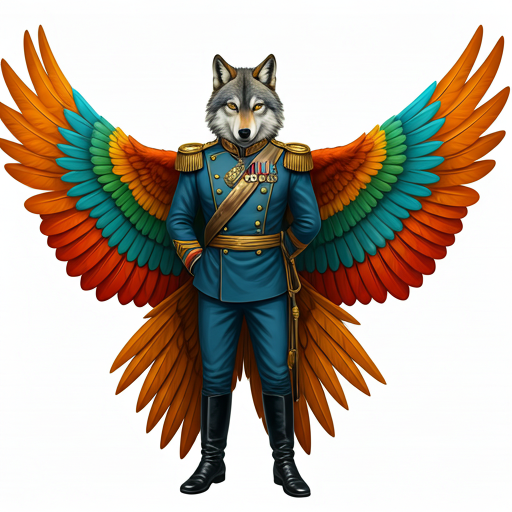

## Invicta Swarm

Ant-like sapients from a cluster far away from the local cluster. They
are a caste based species, with individuals having very different body
plans based on their purpose within the species. They are led by a
Queen, and there are Soldier caste Invictans who are optimized for
battle. There are variants of the Soldier caste, Pilot caste, who are
hatched in tandem with the frame of their starfighter. They retain most
of the hand to hand skills of the base Soldier caste, but have a
preternatural connection to the systems of their starfighter.

The Invicta Swarm is a galactically-distant species of hostile,
expansionist bug-aliens (Ant-Hive type). They have 11 Star Systems and a
single Queen as their ruler and mother. The bugs are high-technology
(T3), specializing in bioengineering and biotechnology (machines that
have a semi-living neuronal basis, alongside normal circuits and machine
parts).They co-evolve these semi-living machines with the Drones that
will use them. Their Drones look like the Thri-Kreen from DnD. To see an
Invictic Drone in our Local Cluster is very unlikely, and worrisome to
those in-the-know.

In recent years, the Swarm has rapidly conquered territory, gaining a
reputation for fearsome invincibility in battle that went beyond the
distant area of space they come from. Funded by the Calcoran Schools, a
coalition of distant civilizations (think a Local Cluster on the other
side of the galaxy) "held the line" in the public narrative (there's a
Starship Troopers-style propaganda Tattnet show about it) and the
Swarm's expansion was halted. Let's say the coalition is called the
Kel-Azaan Resistance.

The less commonly known truth is a weaponized Science
Foundation-engineered virus infected the Swarm's technology and Queen,
glitching their technology and lowering their birth rate.They could
weasel out of this problem with the genetics of a new Queen. Their
current larval Queens (Princesses) are infected.

(But prior to this virus deployment, a larval 'Princess' was stolen for
research by the Science Foundation---this Princess is hidden somewhere
in-or-around the Local Cluster, which is not specifically known to the
Swarm, or there'd be far more investment in the Local Cluster than a
single Drone. How this Princess is being used is not yet established.)

## Grulvax

The Grulvax are a sapient species that is unknown in all of known space,
aside from one individual, Jithal, currently engineer on the ship *Dire Straits*.

They have four arms, a head with no eyes, and a snake-like lower body.
Because they can communicate with other members of their species without
speaking, they will often be eerily silent, not speaking in situations
other sapients would do so. They prefer confined spaces, as they live
underground in tight warrens that are interconnected in a complex maze
of twisty little passages. In these passages, they live communally, and
do not have the idea many other sapients have of "personal space."

As mentioned, they do not have eyes, but use a sort of radar to make
sense of the space around them.

## The Flotilla

A species that lost their home world and now lives in a flotilla of
ships in open space. Their biology and environment requirements are such
that it's unlikely (if not impossible) for them to colonize a new world
and/or build more than small structures. Correspondingly, no one knows
what they really look like, because they're always in fully sealed
suits when outside of the safe environment of their ships.

Individuals can and do leave the Flotilla, so they do interact with
other species, and overall they act almost ubiquitously humble and
obsequious. They are open about telling the story of their lost home
world, and of their hubris that caused it. Now there is a strong
cultural push toward humility and \"not rocking the boat\".

The Flotilla moves nomadically from cluster to cluster every decade or
two, but while they're around they try to establish trade relations
with the locals systems, usually trading technology for the raw
resources they need.

While more open and advanced systems find them to be great to establish
relationships with (the Flotilla's presence is usually a boost to
economies), there are also plenty of folks who don't trust that the
Flotilla's kindness is genuine. They think that the Flotilla is just
waiting for the right moment to start taking worlds. They also don't
believe that hiding their appearance makes them untrustworthy, and think
their "environmental constraints" are just a cover story.

There are factions within the Flotilla, but not much is known by
outsiders about these factions and their differing goals.

## The Calcoran Schools

The Calcoran Schools are a sapient species who evolved underwater, and
are considered by humans to be a cross between jellyfish and dolphins.
They are widely spread across known space, and strive to "civilize" the
galaxy. Their financial systems are dominant in all of the larger
clusters of known space, and in most of the remaining clusters, so much
so that sometimes the species are just referred to as "the Bankers."

They organized and funded the coalition that resisted the Invictic
Swarm's expansion into the greater galaxy.

## Vat Clones

Even though Vat clones look like humans, they are gene-engineered from
human DNA to be the perfect low-level soldier. It's not generally know
who creates them, but new ones show up all the time, everywhere in known
space, so someone must be doing it. They usually show up as new military
units for some polity or another, fighting in local land wars, usually,
occasionally as space marines, boarding enemy ships to take control of
them, et cetera. They all look alike, they mostly act alike.

> This is your first time working with military grown vat clones,
> isn't it?
>
> Yeah, don't let their folksy manners throw you off. They may have
> strong emotions, but they usually don't show it. At best you'll get
> a slight frown or a pleasant smirk. There just is no changing their
> seemingly friendly laid back demeanor. That's about as much intensity
> you'll get from them, but they'll give you their all. Drill
> seargants have given up yelling at recruits because of them.
>
> Vat clones would give you the spacesuit off their back while they're
> using it with a slight smile forever frozen on their face. Don't
> screw anyone over with them present, even another vat clone. They will
> put you in your place, even if you out-rank them, and most everyone
> out-ranks them.
>
> It's said that they all look and act like Lee Majors. Who was Lee
> Majors? Not much is known about him, but he was one of the first
> ancient Earth spacers. He once survived a crash that shredded his
> craft, and he just stood up and walked it off. That's about all
> that's known of him.
>
> They worship the idea of that man.
>
> They claim that they have individual personalities. It's true, but
> it's going to take most people longer to see it. People make
> assumptions about vat clones, and they're usually right - until
> they're not.
> 
> They're almost everywhere. They're ubiquitous. Yeah, I know I just
> repeated myself. They serve. They grow older. They finish their tours.
> They transition to civilian life. They even sometimes get married and
> have kids, though a lot of people worry about how this weakens the
> whole genetic diversity thing. They may even fix that with gene
> therapy. They're happiest when they're helping out. They don't much
> care for promotions or being promoted with maybe an exception or two.
>
> They like to hang out in vat clone bars.

## Cronstak

Sapients who looks like a three-legged mongoose with vestigial, furry
wings, and 3 arms that end in 6 fingered hands, including 2 opposable
thumbs.

## Humans

These guys are the worst.

## Bearbles

Sapients who mostly work in management and supervisory positions, in the
middle tier of any organization. They are brightly colored puffy fur
balls with three eyes and no visible mouth, nose, or ears, or legs,
usually about a meter in diameter. They are either pink, green, or
orange. They speak with a grating burbling voice. They have 5
stick-like, bare, segmented arms with no fur and 3 visible joints,
usually a dull yellow. The arms end in hand-like structures with varying
number of digits. It seems like their digits drop off and grow back
relatively quickly. Their arms can reach up to 2 meters away from their
body in any direction, and they use any 3 of them to walk. They are very
light for their volume.

They usually wear a complex pleated wrap that covers their lower
hemisphere, with straps over the top of their headbodytorso to hold it
in place. The wrap has many pockets. They often wear wraps that contrast
strongly with their natural coloring.

## Bontions

5' tall black and orange striped caterpillar with 8 tentacles.

## Ohlzor

8' tall, heavyset purple bipedal sapients. Known for working as
mercenaries doing whatever work is needed. Loyal to anyone who pays
them.

**Species Aspects**

***Fierce well trained mercenary guards***

***Slow Moving but Unflinching***

## So'enela

{align="right"  caption="Bane's Eye Space Navy Admiral So'enela."}

7' tall, lanky, bilateral symmetry, bipedal, 2 wings. Long face with
large eyes, large pointy ears, and a small black nose. They have 2 arms
with 5 fingered hands. They also have a tentacle below each of their
arms that end in a mass of small tentacles that bifurcate down to the
nano scale, allowing them to manipulate very, very, small things. These
tentacles are usually kept out of harm's way when not in use, by tucking
them under their clothes, as they are very delicate.

Their bodies, including their faces, are covered in short, soft fur,
usually shading from cream on their front to brown on their back.
Although coloration can vary quite a bit, it is always in shades of
white, brown, gray, or black, sometimes spotted in various sizes. Their
wings are vestigial, in the sense that they do not allow them to fly.
The males' wings are feathered in multiple shades of bright colors,
greens, reds, oranges, purples, blues, while the females are in the
plainer colors usually matching their body fur.

They mate for life. The females lay a single clutch of 5-10 eggs, and
the males keep them warm and raise the surviving young while the females
typically provide food and maintain the homes.

Although So'enela are found all over both the local and neighboring
clusters, they are the majority(and dominant) sapient species on Bane's
Eye.

**Species Aspects**

***Industrious and Analytical***

***Must Provide for Our Progeny***

***Our god is always watching what we do***
